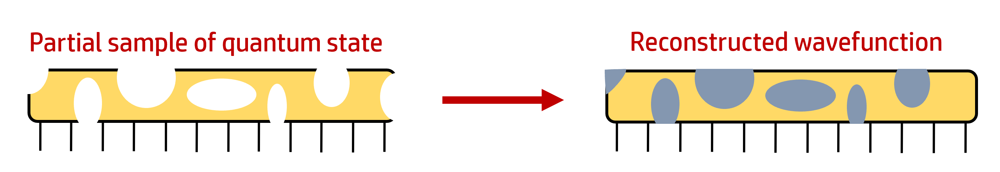
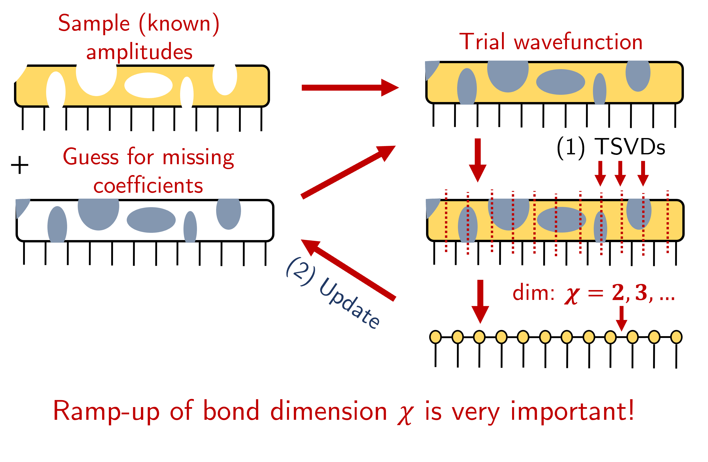
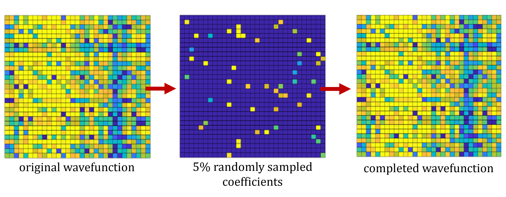
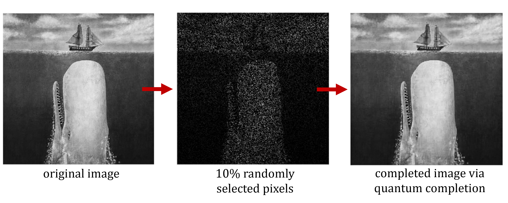

Data Completion
======
In the world of big data, where we appear to have information about anything and everything, it might seem surprising that many datasets, particularly those we are most interested in, are overwhelmingly __incomplete__. Consider the topic of [collaborative filtering](https://en.wikipedia.org/wiki/Collaborative_filtering), where a subset of user preferences are known and we are interested in predicting the user preferences of the typically larger *unknown* subset.

An infamous example of collaborative filtering is the [Netflix problem](https://en.wikipedia.org/wiki/Netflix_Prize), where Netflix offered a cash prize to develop the best collaborative filtering algorithm for predicting user film ratings. Historically, most Netflix users rate well below 1\% of its entire film catalogue, yet we can accurately predict individual user ratings for all films from only this very small sampling. Generally, the problem of trying to "complete" a data set from a subset of known entries (i.e., data completion) is referred to as matrix (2-dimensional) or tensor (N-dimensional) completion. Collaborative filtering problems comprise a subset of the space of all data completion problems.

Quantum Completion
======
**Project motivations**: In quantum many-body physics, various sampling-based schemes exist (e.g., quantum Monte Carlo) for characterizing quantum states. However, what if we have several reliable samples of quantum state coefficients, but we want to "skip to the end" or otherwise discover all of the unreliable or unknown values? This would comprise a data completion problem inside the (Hilbert space)[https://mathworld.wolfram.com/HilbertSpace.html] of quantum wavefunctions. Here is a simple graphicial representation of what quantum (or wavefunction) completion might look like:

Solutions to this problem have use-cases within computational quantum physics, but may also have interesting applications in other areas of data science. Indeed, the interconnected nature of wavefunctions is not strictly unique, and effective algorithms for wavefunction completion may be useful in other settings (e.g., image completion; see results below).

**Programming**: While working as a graduate research scientist with Professor Glen Evenbly at Georgia Tech, I designed and programmed several novel solutions to quantum state completion using Python and Matlab. Some of my findings are discussed in-depth in the article [Reconstruction of Randomly Sampled Quantum Wavefunctions using Tensor Methods](https://arxiv.org/abs/2310.01628) (submitted for publication). In addition to programming algorithms based on tensor network methods (e.g., randomly structured tensor trees, matrix product states), I also developed an independent solution using stacked convolutional neural networks trained with supervised learning, thereby identifying a new use-case for AI and machine learning. Implementations of these approaches and demos are available in Python on my [Github page](https://github.com/astahl3),.

The visual below demonstrates how one of my tensor completion algorithms is deployed. This method is applicable to finite quantum states on 1-D lattices with open boundary conditions. In this approach, matrix product states are used to approximate the unknown wavefunction coefficient values. Critically, (1) the approxiamte or "trial" wavefunction is anchored to the subset of randomly sampled coefficients (i.e., true values), and (2) the bond dimension \\(\chi\\) between tensors is sequentially incremented from the smallest nontrivial value (\\(chi=d\\) where \\(d\\) is the local dimension of each lattice site).

**Results**: Both the neural and tensor network solutions for wavefunction completion demonstrate attractive congergence properties and robust reliability. Low-energy quantum wavefunctions can be completed using either paradigm with near-perfect consistency given a sufficiently large random sample of known wavefunction coefficients. To see what this looks like in practice, consider the sequence below:

The three images above each display a 2-D representation of quantum wavefunction coefficient amplitudes. To start, the true wavefunction (left) is calculated by performing an exact numerical diagonalization of the system's Hamiltonian (see [exactDiagEx.py](https://github.com/astahl3/wavefunction_completion/blob/main/exactDiagEx.py) for the code implementation). Next, 5% of the coefficients that characterize the wavefunction are sampled (center), and then the wavefunction completion routine is applied to restore (or "complete") the unknown state coefficients (right). From our human point-of-view, it would appear that in 2-D, there is not nearly enough information to accurately complete the state (i.e., see middle panel). Indeed, this is correct, and therefore _matrix_ completion algorithms do not work effectively on quantum wavefunctions. In order to restore the state from such a small subset of coefficients, the algorithm must reshape and decompose the quantum state across all nontrivial bipartitions, updating the unknown entries at each shape.

While creating the graphic above, it occurred to me that my solutions to quantum wavefunction completion may also be applicable to conventional image completion (i.e., a subset of pixels are damaged or missing). The sequence below showcases the result:

After repurposing my algorithm to operate on 2-D images instead of N-D tensors, I found that locally reshaping an image into more than two dimensions imparts additional information, allowing for superior image completion. While this rudimentary adaptation of my algorithm is computationally inefficient relative to other proven image completion routines, this tensor-based approach yields accuracies (e.g., PSNR, RMSE) that are competitive with the best existing completion methods. Research into wavefunction completion via tensor and neural networks is still in its infancy, but as I demonstrated here, it is a tractable problem and solutions may have compelling, potentially widespread use-cases in the broader arena of data science.