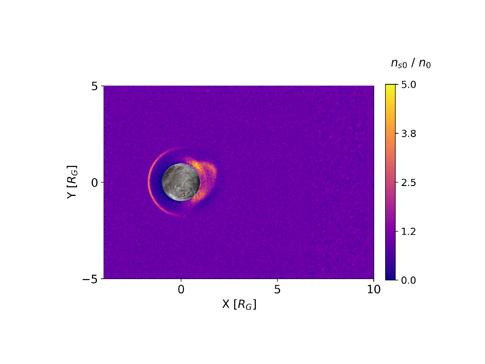

I explore how Jupiter's moons, Ganymede and Europa, interact with the sea of different plasma species inhabiting the Jovian magnetosphere. Ganymede is the only moon known to possess its own intrinsic magnetic field, forming a "mini-magnetosphere" that protects the moon from impinging Jovian plasma. On the other hand, Europa's conductive subsurface ocean generates an induced field, which in turn generates a weaker "induced" magnetosphere that perturbs the flow of plasma in the vicinity of the moon. Both satellites possess fascinating dynamical environments that can be described through a combination of fundamental physical principles, advanced computational methods, and large datasets generated by spacecraft visiting the environment (e.g., Galileo, Juno).

Ganymede
======
**Project motivations:** In June 2021, NASA's Juno spacecraft performed a close flyby of Ganymede and sampled the moon's local interaction region. Prior to this event, Ganymede had not been visited since the Galileo mission over 20 years earlier. During its encounter, Juno acquired the first species-resolved observations of ionospheric outflow and sampled the moon's previously unexplored tail region. These observations represent a significant opportunity to constrain the dynamics and behavior of Ganymede's ionospheric loss processes, and to study how the kinetic effects of ion gryomotion shape the moon's plasma tail.

**Programming:** To understand Ganymede's plasma interaction during Juno's flyby, I modeled the moon and its environment in C++ starting from the **A**daptive **I**on **K**inetic **E**lectron **F**luid source code (AIKEF, see [Müller et al., 2011](https://www.sciencedirect.com/science/article/pii/S0010465510005266)). I programmed a three-dimensional model of Ganymede's ionosphere and integrated this into the existing AIKEF source code, resulting in the first self-consistent model of Ganymede's multi-species plasma tail. I also added extensive functionality to AIKEF to accommodate Ganymede's unique features, including its intrinsically generated global magnetic field. In addition, I performed extensive statistical analysis on Juno's magnetometer and plasma observations (e.g., minimum variance analysis) to look for signatures of magnetic reconnection at Ganymede's magnetopause and to map the structure of the moon's global magnetic topology.

**Results:** Many of my findings on this topic are included in the journal article, [A Model of Ganymede's Magnetic and Plasma Environment During the Juno PJ34 Flyby](https://agupubs.onlinelibrary.wiley.com/doi/full/10.1029/2023JA032113). Below, I highlight a the most interesting results. 

Our results include the first demonstration of Kelvin-Helmholtz instability forming along Ganymede's Jupiter-facing magnetopause flank. The movie above, which displays the  shows how linear Kelvin-Helmholtz waves form and propagate in the direction of ambient Jovian plasma. 

<link rel="stylesheet"
href="https://maxcdn.bootstrapcdn.com/font-awesome/4.4.0/css/font-awesome.min.css">

  
  

    <input id="_anim_sliderfa36777bc3a2452f97f38f5050d9f389" type="range" class="anim-slider"
           name="points" min="0" max="1" step="1" value="0"
           oninput="animfa36777bc3a2452f97f38f5050d9f389.set_frame(parseInt(this.value));">
    

      <button title="Decrease speed" aria-label="Decrease speed" onclick="animfa36777bc3a2452f97f38f5050d9f389.slower()">
          <i class="fa fa-minus"></i></button>
      <button title="First frame" aria-label="First frame" onclick="animfa36777bc3a2452f97f38f5050d9f389.first_frame()">
        <i class="fa fa-fast-backward"></i></button>
      <button title="Previous frame" aria-label="Previous frame" onclick="animfa36777bc3a2452f97f38f5050d9f389.previous_frame()">
          <i class="fa fa-step-backward"></i></button>
      <button title="Play backwards" aria-label="Play backwards" onclick="animfa36777bc3a2452f97f38f5050d9f389.reverse_animation()">
          <i class="fa fa-play fa-flip-horizontal"></i></button>
      <button title="Pause" aria-label="Pause" onclick="animfa36777bc3a2452f97f38f5050d9f389.pause_animation()">
          <i class="fa fa-pause"></i></button>
      <button title="Play" aria-label="Play" onclick="animfa36777bc3a2452f97f38f5050d9f389.play_animation()">
          <i class="fa fa-play"></i></button>
      <button title="Next frame" aria-label="Next frame" onclick="animfa36777bc3a2452f97f38f5050d9f389.next_frame()">
          <i class="fa fa-step-forward"></i></button>
      <button title="Last frame" aria-label="Last frame" onclick="animfa36777bc3a2452f97f38f5050d9f389.last_frame()">
          <i class="fa fa-fast-forward"></i></button>
      <button title="Increase speed" aria-label="Increase speed" onclick="animfa36777bc3a2452f97f38f5050d9f389.faster()">
          <i class="fa fa-plus"></i></button>
    

    <form title="Repetition mode" aria-label="Repetition mode" action="#n" name="_anim_loop_selectfa36777bc3a2452f97f38f5050d9f389"
          class="anim-state">
      <input type="radio" name="state" value="once" id="_anim_radio1_fa36777bc3a2452f97f38f5050d9f389"
             >
      <label for="_anim_radio1_fa36777bc3a2452f97f38f5050d9f389">Once</label>
      <input type="radio" name="state" value="loop" id="_anim_radio2_fa36777bc3a2452f97f38f5050d9f389"
             checked>
      <label for="_anim_radio2_fa36777bc3a2452f97f38f5050d9f389">Loop</label>
      <input type="radio" name="state" value="reflect" id="_anim_radio3_fa36777bc3a2452f97f38f5050d9f389"
             >
      <label for="_anim_radio3_fa36777bc3a2452f97f38f5050d9f389">Reflect</label>
    </form>
  

Test image load: 

Radation Belts at Ganymede
======

Europa
======

ENA Imaging
======
**Project motivations:** Historically, all space-based measurements of electric and magnetic fields are limited to single lines through 3-D space (i.e., along isolated spacecraft trajectories). As a result, these observations provide only a limited snapshot in time and space, and tell us little about the 3-D structures and the physical processes underlying the observations. ENA images, on the other hand, are 2-D measurements of global ENA emissions. Due to the coupling between ENAs and their surrounding electromagnetic environment, these images can also be viewed as 2-D "photographs" of the magnetic field. The European Space Agency's JUICE spacecraft, which is scheduled to enter into orbit around Ganymede in 2034, is equipped with an ENA camera that will provide thousands of these images. Therefore, it is critical to understand the coupling dynamics between ENAs and their surrounding electromagnetic environment. Such understanding can provide us with the ability to translate the raw data to 2-D pictures of the magentic field.

